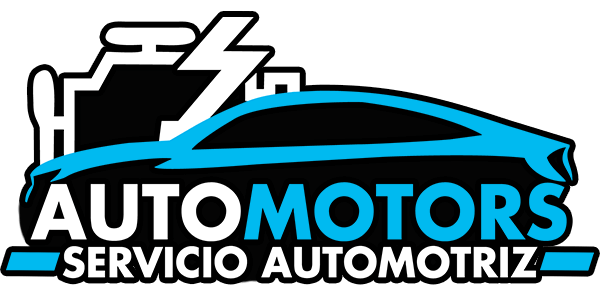

  

# ***PROYECTO: SERVICIO AUTOMOTRIZ “AUTO MOTORS”***
## Empresa colombiana con franquicias. Ofrece servicios y productos como cambio de aceite, cambio de filtros, venta de cubiertas, llantas, entre otras.    

## Descripción del proyecto:
Contamos con datos internos de la empresa como ventas y empleados.Requieren analizar el impacto de la pandemia para evaluar para poder tomar la decisión de si es recomendable salir a buscar inversores, vender la empresa o ir a la quiebra

## Alguno de los Indicadores básicos:
- Venta Total   
- Cantidad de Elementos vendidos  
- Ganancia Facturación Total de Servicios  
- Cantidad de Servicios Ofrecidos  
- Cantidad de Sedes o ubicaciones disponibles  
- Ventas totales por Sedes en cada Rubro o Familia y Servicios  
- Ventas realizadas por sus empleados  
- Ranking de Ventas / Servicios de Empleados 